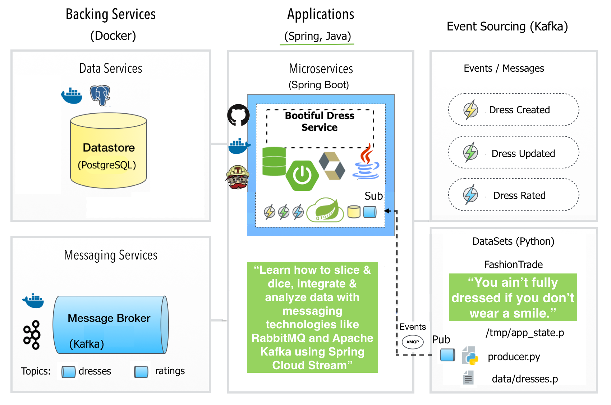

## Bootiful Dress Service: AMQP-driven event processor to consume data for dresses and ratings domain aggregates from a Python Producer and expose it via a REST API


[](https://travis-ci.org/cristinanegrean/spring-cloud-stream-kafka)
[](https://coveralls.io/github/cristinanegrean/spring-cloud-stream-kafka?branch=master)
[](https://bettercodehub.com/)


Blog posts:
* http://cristina.tech/2017/08/09/dresses-stream-processing-and-apache-kafka
* http://cristina.tech/2017/08/28/testing-a-spring-cloud-stream-microservice

Demonstrated concepts:

* Event Stream Processing
* Handling out-of-order events
* REST API to display consumed data, complete with paging and sorting
* Windowing with out-of-order data, aggregation and lookup, using
`count so far`. The timestamp used for windowing is the timestamp in the rating message event (event-time)
* See screenshots [here](https://github.com/cristinanegrean/spring-cloud-stream-kafka/tree/master/screenshots)



### Technology stack used:
* Mainstream programming language: [Java](http://www.oracle.com/technetwork/java/javase/downloads/jdk8-downloads-2133151.html) for implementing the subscriber/consumer application that receives events for stream processing from Kafka over AMQP protocol, in order to consume the data for dresses and ratings
* [Apache Kafka](http://kafka.apache.org/): message broker responsible for distributing the events
* [Spring Cloud Stream](https://cloud.spring.io/spring-cloud-stream/): build message-driven microservices. Spring Cloud Stream provides an opinionated configuration of message brokers (Kafka or RabbitMQ), introducing the concepts of persistent pub/sub semantics, consumer groups and partitions for horizontal scaling.
* [Spring Integration](https://projects.spring.io/spring-integration/): provide connectivity to message brokers, is used under the hood by Spring Cloud Stream.
* [Spring Data Rest](http://projects.spring.io/spring-data-rest/)
* [Spring Data JPA](http://projects.spring.io/spring-data-jpa/)
* [Hibernate Validator](http://hibernate.org/validator/), which is the reference implementation of [JSR 303/349 - Bean Validation 1.0/1.1 API] (http://beanvalidation.org/1.1/spec/)
* [PostgreSQL 9.6.3](https://www.postgresql.org/) open-source datastore
* [Spring Boot 2](http://projects.spring.io/spring-boot/): helps assembling a DevOps friendly, self-runnable uber-fat-jar of the autonomous consumer microservice application
* [Docker](https://www.docker.com/docker-mac) Least but not last, Docker is used to automate infrastructure (Want to get up-and-running fast and test the
  dress streaming service, without having to install anything than Java 8, Docker and Python?)

### Bootstraping the service

1) Clone Git repo

```
$ git clone https://github.com/cristinanegrean/spring-cloud-stream-kafka
$ cd spring-cloud-stream-kafka
```

Build and run tests. And the Docker image of the SpringBoot microservice. Note Gradle local installation is not required, as project is shipping the [Gradle Wrapper](https://docs.gradle.org/3.3/userguide/gradle_wrapper.html)

```
$ ./gradlew clean build docker
```

2) Bootstrap Services: Kafka Zookeeper, Postgres and the `Dress Consumer Service`

#### Using Docker (simplest, thus recommended):

Use Docker Compose tool and provided docker-compose.yml file for bootstraping the multi-container application.

```
$ docker-compose up
```

You can check status of Zookeeper Server, Kafka, Postgres via connecting
to the docker container, as bellow:

```
$ docker ps
$ docker exec -i -t ${CONTAINER ID} bash
```

#### When no Docker installed, on OS X follow below steps:

2.1) [Download and install Apache Kafka](https://kafka.apache.org/quickstart)

2.2) Install PostgreSQL, start server and create `dresses` DB. On OS X:

```
$ brew install postgres
$ postgres -D /usr/local/var/postgres
$ createdb dresses
$ psql -h localhost -U postgres dresses
```

2.3) Update your .bash_profile file: add KAFKA_HOME, KAFKA_HOST_PORT, DOCKER_IP,
POSTGRES_USER, POSTGRES_PASSWORD environment variables. These will be used by producer and consumer applications as externalized machine specific configuration.
Also add aliases to start ZooKeeper, Kafka, Postgres server, to save on typing long commands each time.

```
export KAFKA_HOME=/opt/kafka_2.11-0.10.2.0
export PATH=$PATH:$KAFKA_HOME

export POSTGRES_USER=postgres
export POSTGRES_PASSWORD=demo

alias zoostart="$KAFKA_HOME/bin/zookeeper-server-start.sh $KAFKA_HOME/config/zookeeper.properties"
alias zoostop="$KAFKA_HOME/bin/zookeeper-server-stop.sh"

alias zoostat="echo stat | nc 127.0.0.1 2181"
alias zoomntr="echo mntr | nc 127.0.0.1 2181"
alias zooenvi="echo envi | nc 127.0.0.1 2181"

alias kafkastart="$KAFKA_HOME/bin/kafka-server-start.sh $KAFKA_HOME/config/server.properties"
alias kafkastop="$KAFKA_HOME/bin/kafka-server-stop.sh"

alias postgres="postgres -D /usr/local/var/postgres"
```


2.4) Open a new terminal window and Start Apache Zookeeper first.
The Apache Kafka distribution comes with default configuration files for both Zookeeper and Kafka, which makes getting started easy.

```
$ zoostart
```

You can check now that Zookeeper server is running correctly via previous
configured alias commands:

```
$ zoostat
$ zoomntr
$ zooenvi
```

2.5) Then start Apache Kafka, in a new terminal window:

```
$ kafkastart
```

2.6) Start the fancy dress service (default active development profile):

```
$ java -jar build/libs/spring-cloud-stream-kafka-1.0.0-SNAPSHOT.jar
```

3) Start the Producer Python Script that produces data for `dresses` and `dress ratings` on two different Kafka topics named `dresses` and `ratings` (this is hard coded).

The script reads an environment variable named `KAFKA_HOST_PORT` to discover the Kafka broker server to connect to and falls back to
`localhost:9092`

When running services via Docker, you'll need add the host name "kafka" and its corresponding IP in /etc/hosts, as below:

```
127.0.0.1       kafka
```

Python requirements installation on OS X:

```
$ brew install python3
$ brew link python3
$ python3 -m ensurepip
```

Edit `.bash_profile`:

```
export KAFKA_HOST_PORT=localhost:9092
export PYTHON_HOME=/usr/local/bin/python3
export PATH=$PATH:$PYTHON_HOME
```

Install packages and start the script:

```
$ python3 -m pip install numpy click kafka-python
$ cd spring-cloud-stream-kafka/src/main/resources/
$ sudo python3 producer.py
```

The producer.py script sends messages on two separate topics: `dresses` and `ratings`. These messages contain information on individual dresses and dress ratings (1 to 5 stars) respectively.

### Message formats

All messages on Kafka contain JSON strings, which are UTF-8 encoded (as per the JSON by specification).

##### Dress message format
Example message:

```json
{
  "status": "CREATED",
  "payload_key": "AX821CA1M-Q11",
  "payload": {
    "id": "AX821CA1M-Q11",
    "images": [
      {
        "large_url": "http://i6.ztat.net/large_hd/AX/82/1C/A1/MQ/11/AX821CA1M-Q11@10.jpg",
        "thumb_url": "http://i6.ztat.net/catalog_hd/AX/82/1C/A1/MQ/11/AX821CA1M-Q11@10.jpg"
      },
      {
        "large_url": "http://i3.ztat.net/large_hd/AX/82/1C/A1/MQ/11/AX821CA1M-Q11@9.jpg",
        "thumb_url": "http://i3.ztat.net/catalog_hd/AX/82/1C/A1/MQ/11/AX821CA1M-Q11@9.jpg"
      }
    ],
    "activation_date": "2016-11-22T15:18:41+01:00",
    "name": "Jersey dress - black",
    "color": "Black",
    "season": "WINTER",
    "price": 24.04,
    "brand": {
      "logo_url": "https://i3.ztat.net/brand/9b3cabce-c405-44d7-a62f-ee00d5245962.jpg",
      "name": "Anna Field Curvy"
    }
  },
  "timestamp": 1487593122542
}
```

The `status` field tells you whether the message contains a creation or a update of a dress using the values `CREATED` or `UPDATED` respectively. The `payload_key` will always have the same value as the `id` field of the contained dress.

##### Rating message format
Example message:

```json
{
  "status": "CREATED",
  "payload_key": "c29b98c2-00fb-4766-938e-9e511d5f5c55",
  "payload": {
    "rating_id": "c29b98c2-00fb-4766-938e-9e511d5f5c55",
    "dress_id": "NM521C00M-Q11",
    "stars": 1
  },
  "timestamp": 1487596717302
}
```

Unlike dresses, ratings are never updated.

#### Miscelaneous:

* [Project Lombok](https://projectlombok.org/) has been used to get rid of boiler plate code as getters, setters, no argument constructors in Entity, POJOs, Data Objects.
* Application health endpoint, non-sensitive: http://localhost:8081/admin/actuator/health
* Fancy dress service is using [Flyway](https://flywaydb.org/) to evolve the `dresses` DB schema. Schema version is available using the non-sensitive admin
 endpoint: http://localhost:8081/admin/actuator/flyway or from the psql console

