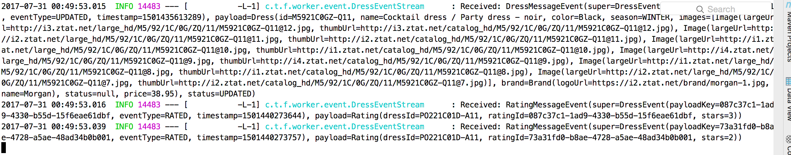
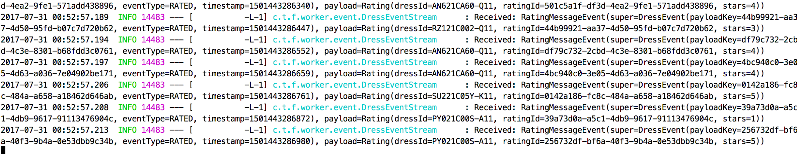
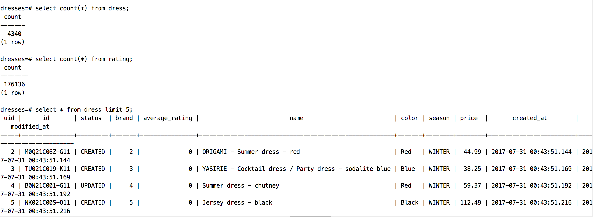
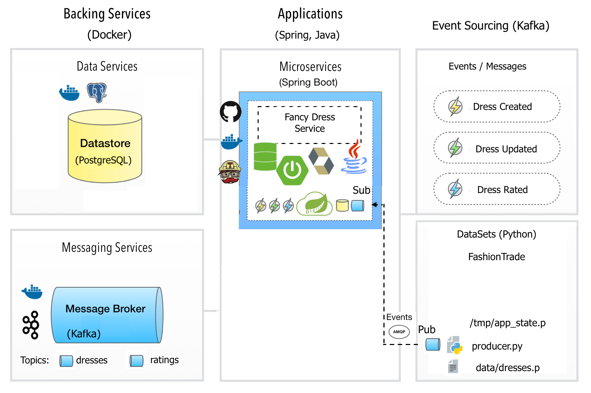

## Fancy Dress Worker Service: AMQP-driven event processor to consume data for dresses and ratings domain aggregates.


Demonstrated concepts:

* Event Stream Processing



* Eventual Consistency
* Compensating Transactions

TODO: Update overview with concise implementation: 1 service component handing both worker + web

Desired production architecture when scalling AMQP-driven event message processor separately from hypermedia driven web service



### Spring projects and technology stack used:
* Mainstream programming language: [Java](http://www.oracle.com/technetwork/java/javase/downloads/jdk8-downloads-2133151.html) for implementing the subscriber/consumer application that receives events for stream processing from Kafka over AMQP protocol, in order to consume the data for dresses and ratings
* [Apache Kafka](http://kafka.apache.org/): message broker responsible for distributing the events
* [Spring Cloud Stream](https://cloud.spring.io/spring-cloud-stream/): build message-driven microservices. Spring Cloud Stream provides an opinionated configuration of message brokers (Kafka or RabbitMQ), introducing the concepts of persistent pub/sub semantics, consumer groups and partitions for horizontal scaling.
* [Spring Integration](https://projects.spring.io/spring-integration/): provide connectivity to message brokers, is used under the hood by Spring Cloud Stream.
* [Spring Data Rest](http://projects.spring.io/spring-data-rest/)
* [Spring Data JPA](http://projects.spring.io/spring-data-jpa/)
* [Hibernate Validator](http://hibernate.org/validator/), which is the reference implementation of [JSR 303/349 - Bean Validation 1.0/1.1 API] (http://beanvalidation.org/1.1/spec/)
* [PostgreSQL 9.6.3](https://www.postgresql.org/) open-source datastore
* [Spring Boot](http://projects.spring.io/spring-boot/): helps assembling a DevOps friendly, self-runnable uber-fat-jar of the autonomous consumer microservice application

### Bootstraping the service

1) Clone Git repo

```
$ git clone https://github.com/cristinanegrean/spring-cloud-stream-kafka
$ cd spring-cloud-stream-kafka
```

Build and run tests. And the Docker image of the SpringBoot microservice. Note Gradle local installation is not required, as project is shipping the [Gradle Wrapper](https://docs.gradle.org/3.3/userguide/gradle_wrapper.html)

```
$ ./gradlew clean build buildDocker
```

2) Bootstrap Backing Services (Kafka Zooker, Redis) and the `Dress Consumer Service`

#### Using Docker:

Use Docker Compose tool and provided docker-compose-dev.yml file for bootstraping the multi-container application.

```
docker compose -f docker-compose-dev.yml up
```

#### When no Docker installed, on OS X follow below steps:

2.1) [Download Apache Kafka binaries](https://kafka.apache.org/quickstart)
2.2) Update your .bash_profile file with KAFKA_HOME environment variable, and add aliases to start ZooKeeper server and Kafka server (in case you want to save on typing commands each time)

```
export KAFKA_HOME=/opt/kafka_2.11-0.10.2.0
export REDIS_HOME=/opt/redis-4.0.0
export PATH=$PATH:$KAFKA_HOME:$REDIS_HOME

export KAFKA_HOST_PORT=localhost:9092
export DOCKER_IP=127.0.0.1

export POSTGRES_USER=postgres
export POSTGRES_PASSWORD=demo

alias zoostart="$KAFKA_HOME/bin/zookeeper-server-start.sh $KAFKA_HOME/config/zookeeper.properties"
alias zoostop="$KAFKA_HOME/bin/zookeeper-server-stop.sh"

alias zoostat="echo stat | nc 127.0.0.1 2181"
alias zoomntr="echo mntr | nc 127.0.0.1 2181"
alias zooenvi="echo envi | nc 127.0.0.1 2181"

alias kafkastart="$KAFKA_HOME/bin/kafka-server-start.sh $KAFKA_HOME/config/server.properties"
alias kafkastop="$KAFKA_HOME/bin/kafka-server-stop.sh"

alias postgres="postgres -D /usr/local/var/postgres"
```

2.3) Install Data Services

Install and start Postgres, create `dresses` DB:

```
$ brew install postgres
$ postgres
$ createdb dresses
$ psql -h localhost -U postgres dresses
```

2.4) Open a new terminal window and Start Apache Zookeeper first.
The Apache Kafka distribution comes with default configuration files for both Zookeeper and Kafka, which makes getting started easy.

```
$ zoostart
```

2.5) Then start Apache Kafka, in a new terminal window:

```
$ kafkastart
```

2.6) Run the service (with active development profile):

```
$ java -jar build/libs/spring-cloud-stream-kafka-1.0.0-SNAPSHOT.jar
```

3) Start the Producer Python Script that produces data for `dresses` and `dress ratings` on two different Kafka topics named `dresses` and `ratings` (this is hard coded). The script reads an environment variable named `KAFKA_HOST_PORT` to discover the Kafka broker server to connect to.

Python requirements installation on OS X:

```
$ brew install python3
```

Edit `.bash_profile`:

```
export PYTHON_HOME=/usr/local/bin/python3
export PATH=$PATH::$PYTHON_HOME
export KAFKA_HOST_PORT=localhost:9092
export DOCKER_IP=127.0.0.1
```

Install packages and start the script:

```
$ python3 -m pip install numpy click kafka-python
$ cd spring-cloud-stream-kafka/src/main/resources/
$ sudo python3 producer.py
```

The producer.py script sends messages on two separate topics: `dresses` and `ratings`. These messages contain information on individual dresses and dress ratings (1 to 5 stars) respectively.

### Message formats

All messages on Kafka contain JSON strings, which are UTF-8 encoded (as per the JSON by specification).

##### Dress message format
Example message:

```json
{
  "status": "CREATED",
  "payload_key": "AX821CA1M-Q11",
  "payload": {
    "id": "AX821CA1M-Q11",
    "images": [
      {
        "large_url": "http://i6.ztat.net/large_hd/AX/82/1C/A1/MQ/11/AX821CA1M-Q11@10.jpg",
        "thumb_url": "http://i6.ztat.net/catalog_hd/AX/82/1C/A1/MQ/11/AX821CA1M-Q11@10.jpg"
      },
      {
        "large_url": "http://i3.ztat.net/large_hd/AX/82/1C/A1/MQ/11/AX821CA1M-Q11@9.jpg",
        "thumb_url": "http://i3.ztat.net/catalog_hd/AX/82/1C/A1/MQ/11/AX821CA1M-Q11@9.jpg"
      }
    ],
    "activation_date": "2016-11-22T15:18:41+01:00",
    "name": "Jersey dress - black",
    "color": "Black",
    "season": "WINTER",
    "price": 24.04,
    "brand": {
      "logo_url": "https://i3.ztat.net/brand/9b3cabce-c405-44d7-a62f-ee00d5245962.jpg",
      "name": "Anna Field Curvy"
    }
  },
  "timestamp": 1487593122542
}
```

The `eventType` field tells you whether the message contains a creation or a update of a dress using the values `CREATED` or `UPDATED` respectively. The `payload_key` will always have the same value as the `id` field of the contained dress.

##### Rating message format
Example message:

```json
{
  "status": "CREATED",
  "payload_key": "c29b98c2-00fb-4766-938e-9e511d5f5c55",
  "payload": {
    "rating_id": "c29b98c2-00fb-4766-938e-9e511d5f5c55",
    "dress_id": "NM521C00M-Q11",
    "stars": 1
  },
  "timestamp": 1487596717302
}
```

Unlike dresses, ratings are never updated.

#### Miscelaneous:

* Using Project Lombok to get rid of boiler plate code as getters, setters,
 no argument constructors in Entity, POJOs, Data Objects
* Application health endpoint: http://localhost:9000/health
